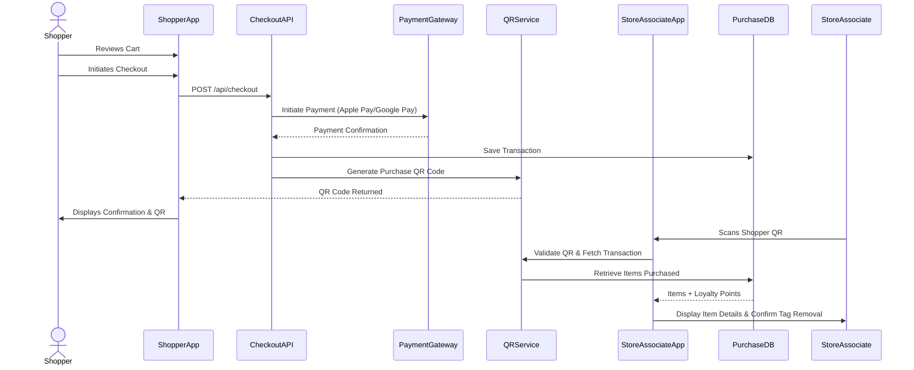
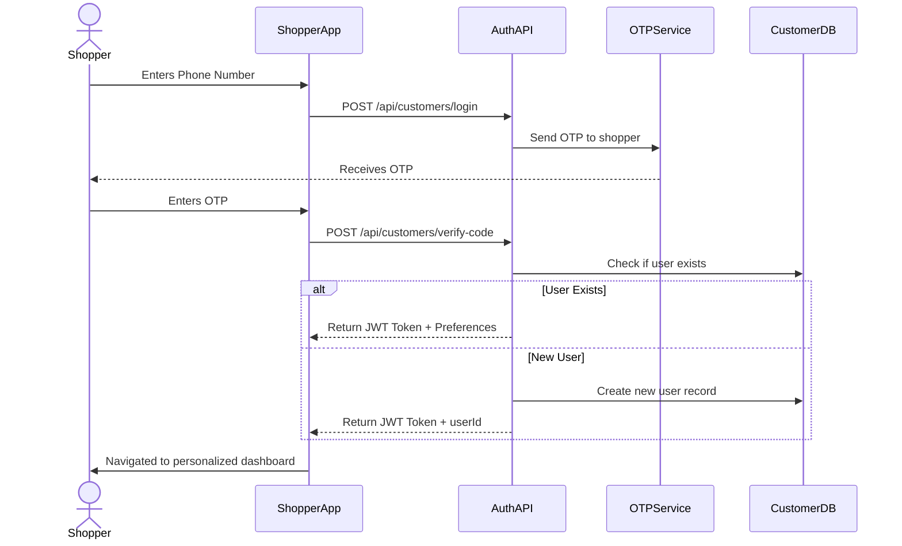
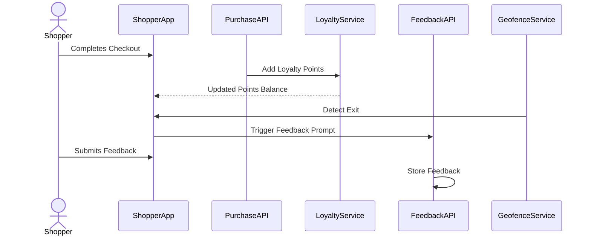
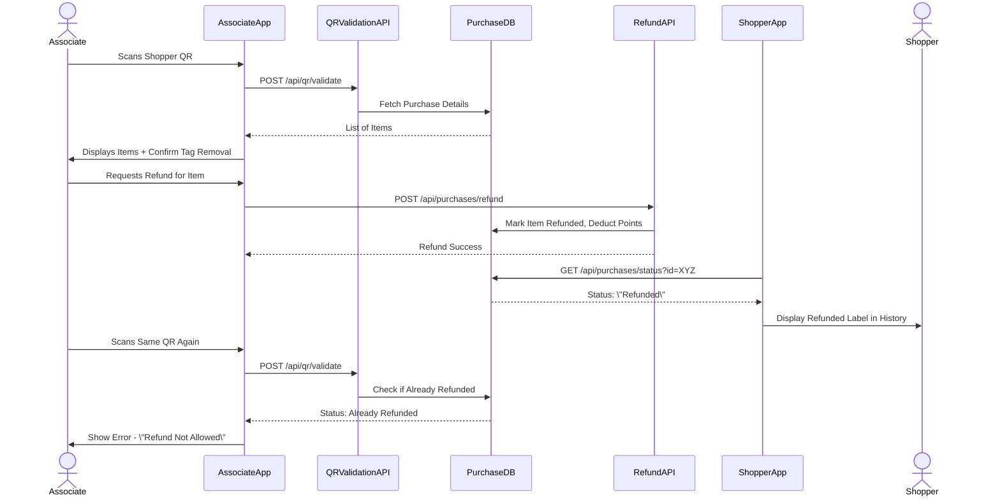

## 📌 Technical Product Owner Assessment Output  
### Case Study: Digital Retail Transformation — Millennial In-Store Shopping App  

---

## ✅ Feature Focus: **Contactless Checkout Flow** (EPIC 4)

### 🎯 Objective:
To enable frictionless checkout for shoppers through a mobile app using Apple Pay/Google Pay, displaying a transaction-based QR code for verification and tag removal by store associates.

---

## 🔄 User Journey Sequence Diagram (Simplified)

---

## 🔌 Integration Points

| Integration Area                | System             | Endpoint/API                                 | Description                                                                 |
|-------------------------------|--------------------|----------------------------------------------|-----------------------------------------------------------------------------|
| Checkout                      | App → Backend       | POST `/api/checkout`                         | Receives items and initiates payment                                        |
| Payment                       | Backend → Gateway   | Apple Pay / Google Pay                       | Processes transaction securely                                              |
| Purchase Recording            | Backend → DB        | Internal DB call                             | Saves transaction + timestamps                                              |
| QR Code Generation            | Backend → QRService | POST `/api/qr/generate`                      | Creates QR with encoded purchase ID & checksum                              |
| QR Scan & Validation          | Associate App → QRService | POST `/api/qr/validate`                | Verifies QR and retrieves purchase                                          |
| Tag Removal Confirmation      | Associate App → Backend | POST `/api/purchases/verify-exit`        | Marks items as confirmed + logs associate action                            |

---

## 📋 Breakdown of Feature: **Contactless Checkout (EPIC 4)**

### USER STORY 4.1: Review Cart Before Payment
- **Goal**: Give shoppers a chance to edit their cart before paying
- **Acceptance Criteria**:
  - Items in cart shown with price, quantity, and remove/edit options
  - Total price dynamically updated
  - Remove/edit items before confirming

### USER STORY 4.2: Checkout via Apple Pay/Google Pay
- **Goal**: Enable fast, secure digital checkout within the store
- **Acceptance Criteria**:
  - Only available inside geofenced store zone
  - Transaction summary and (QR code containing items bought) are shown in a success overlay with a dismiss action button
  - Failure due to either the client-side or the server-side should be shown to the user in an overlay with a retry and cancel action buttons
  - QR code displayed after successful purchase
  - Receipt viewable/downloadable via app in the purchase history screen

### USER STORY 4.3: Post-Purchase QR Code Generation
- **Goal**: Allow store associate to verify purchase and remove security tags by generating a digital reciept (QR Code)
- **Acceptance Criteria**:
  - QR code displayed after successful purchase
  - Failure due to either the client-side or the server-side should be shown to the user in an overlay with a retry and cancel action buttons
  - Also accessible in “Purchase History” screen

---

## 🔐 Technical Considerations
- **Security**:
  - Only scannable via authenticated Store Associate App within the Store's geofence
  - JWT used for both shopper and associate apps

- **Resilience**:
  - Payment handled via retries if network interruption
  - QR stored in backend and in purchase history screen in case user accidentally closes overlay

- **Performance**:
  - QR generation cached for 1 hour per transaction

---

## ✅ Outcome
This journey ensures that the millennial shopper can seamlessly complete a purchase using their mobile device, then present a secure, scannable proof of purchase to store associates — combining speed, convenience, and in-store security in one compact flow.

---

## ✅ Feature Focus: **Login & Registration Flows (EPIC 1.2 + 1.3)**

### 🎯 Objective:
Allow a guest user to become a known, authenticated shopper by either registering or logging in with a mobile number, linking their profile and personalizing their session.

---

## 🔄 Sequence Diagram: Login & Registration Flow

---

## 🔌 Integration Points

| Integration Area       | System              | Endpoint/API                              | Description                                               |
|------------------------|---------------------|-------------------------------------------|-----------------------------------------------------------|
| Login                  | App → AuthAPI       | POST `/api/customers/login`               | Sends mobile or password to start login process           |
| OTP                    | AuthAPI → OTPService| Internal or 3rd-party OTP API              | Sends verification code to user's phone                   |
| OTP Verification       | App → AuthAPI       | POST `/api/customers/verify-code`         | Verifies OTP, returns token                               |
| Customer Identity      | AuthAPI ↔ CustomerDB| Internal DB call                          | Create new user or fetch existing profile                 |

---

## 📋 Breakdown of Feature: **Login & Registration**

### USER STORY 1.2: Login Flow
- **Goal**: Allow existing users to securely log in with their phone
- **Acceptance Criteria**:
  - User can enter mobile and receive a verification code (OTP).
  - Upon successful login:
    - JWT token is returned anfd securely stored on the device
    - Session is initiated and persisted
    - App transitions to personalized dashboard (TBD later when implementing martech tech)
  - Upon Failure:
Show an overlay mentioning the cause of failure and an action button “Close” that takes the user to the last loaded screen (Login screen in this case) so that they can edit their login info and retry.

### USER STORY 1.3: Registration Flow
- **Goal**: Allow new users to register with name and phone number
- **Acceptance Criteria**:
  - Register screen includes:
    - First name, Last name
    - Mobile number
    - Once the user enters his/her registration data, they’re navigated to the OTP verification screen/Overlay and enter the received OTP
  - Upon success:
    - Account created
    - Unique customer ID returned and cached locally on the client side (app) to be sent later in the Headers with each and every API call
    - JWT token is returned and securely stored on device
  - Upon Failure: Show an overlay mentioning the cause of failure and action button “Retry” that takes the user to the last loaded screen so to retry at the last step

---

## ✅ Feature Focus: **Loyalty & Feedback (EPIC 6)**

### 🎯 Objective:
Reward shoppers for engagement and allow them to give feedback post-purchase to improve the experience and retain loyalty.

---

## 🔄 Sequence Diagram: Loyalty + Feedback Flow

---

## 🔌 Integration Points

| Integration Area       | System              | Endpoint/API                              | Description                                               |
|------------------------|---------------------|-------------------------------------------|-----------------------------------------------------------|
| Loyalty Points         | Backend → Loyalty   | POST `/api/loyalty/earn`                  | Adds points on purchase                                   |
| Feedback Prompt        | App ← Geofence      | Triggers post-visit rating                 | Triggered once user exits store                           |
| Feedback Submission    | App → FeedbackAPI   | POST `/api/feedback`                      | Stores shopper feedback                                   |

---

## 📋 Breakdown of Feature: **Loyalty & Feedback**

### USER STORY 6.1: Loyalty Points Earned
- **Goal**: Reward shopper for completing purchase
- **Acceptance Criteria**:
  - As a user, i want to be able to access my Loyalty dashboard and see the earned points based on the products i bought
  - Points added upon purchase confirmation/ transaction completion

### USER STORY 6.2: Feedback Form Triggered Post-Visit
- **Goal**: Gather shopper experience feedback
- **Acceptance Criteria**:
  - Automatically prompts feedback after after making a successful purchase and leaving the shop’s geofence.
  - Star rating + text input form
  - Stored anonymously or linked by user ID

---

## ✅ Feature Focus: **Store Associate QR Verification & Refund Flow (EPIC 9)**

### 🎯 Objective:
Enable store associates to securely verify customer purchases, remove tags, and process refunds using a business app linked to store workflows.

---

## 🔄 Sequence Diagram: Associate QR Scan & Refund Flow

---

## 🔌 Integration Points

| Integration Area       | System              | Endpoint/API                              | Description                                               |
|------------------------|---------------------|-------------------------------------------|-----------------------------------------------------------|
| QR Scan Validation     | Associate App → API | POST `/api/qr/validate`                   | Validates shopper's QR and fetches item list              |
| Refund Processing      | App → Refund API    | POST `/api/purchases/refund`              | Handles refund, points deduction, audit logging           |
| Purchase DB Access     | APIs → DB           | Internal lookup by purchase ID            | Pulls items and timestamps                                |

---

## 📋 Breakdown of Feature: **Store Associate Enablement**

### USER STORY 9.2: Verify Purchase via QR
- **Goal**: Allow associate to verify customer purchase
- **Acceptance Criteria**:
  - Scan QR and fetch list of purchased items
  - Show summary, timestamp, associate confirmation button

### USER STORY 9.4: Process Refund
- **Goal**: Let associate process return for eligible items
- **Acceptance Criteria**:
  - Scan QR → fetch refundable items
  - Confirm refund request
  - Deduct points and log refund in audit trail

---
